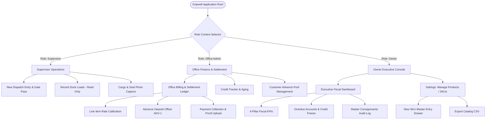

# Gripwell — Design System & Screen Architecture Specification

> **Project Name:** Modern Billing App (Gripwell / FleetBill Logistics)  
> **Stitch Project ID:** `4970474604554189402`  
> **Source Platform:** Google Stitch (Text-to-UI Pro)  
> **Target Framework:** React Native / Expo (v54+) / Expo Router / TypeScript / React Native Web / NativeWind  
> **Target Platforms:** Android, iOS, Web (Single Unified Codebase)  
> **Documentation Version:** 1.0.0 — Production Architecture Phase

---

## 1. Product Overview

Based strictly on the Stitch project assets, interactive prototype (`dispatch_manager-1.html`), design tokens (`designMd`), and visual screen instances, **Gripwell** is an enterprise road freight dispatch management, gate operations, and terminal billing settlement system. It bridges the operational divide between warehouse loading dock supervisors, terminal billing desk administrators, and business owners/executives.

### Core Business Domains Represented in the Design:

1. **Outbound Dispatch Staging & Gate Pass Operations:**
   - Dock supervisors capture truck registration (linked with VAHAN verification), driver credentials (name, phone, driving licence), consignee destination, and notes.
   - Physical manifest counts (SKUs, quantities, carton/pallet packaging) are verified at the dock bay.
   - Digital verification incorporates outbound cargo rear photos (with gate seal verification) and gate pass generation with automated SMS alerts.
   - Dock supervisors operate with **masked pricing and freight rates** to prevent billing disputes at the yard.
2. **Terminal Finance & Office Billing Ledger:**
   - Office administrators calibrate line-item unit rates against staged cargo manifests.
   - Pre-funded customer advance deposits (e.g. `ADV-1` pools) can be applied to offset invoice subtotals.
   - Reconciles multi-mode customer payments: Immediate Cash, UPI / NEFT, Bank Transfer, Cheque, and Deferred Credit terms (Net-15 / Net-30).
   - Allows capturing payment proof screenshots/bank slips (PNG, JPG, PDF up to 10MB), generating pro-forma invoices, committing final transactions to the master ledger, or voiding consignments with audit trail notes.
3. **Credit Ledger & Receivables Risk Management:**
   - Tracks overdue customer accounts, aging debit cycles, and active credit exposure.
   - Provides administrative controls to freeze customer credit upon overdue threshold violations or view granular account ledgers.
4. **Owner Executive Fiscal Oversight & Master SKU Management:**
   - Real-time aggregated fiscal visibility: today's invoiced cargo, collected revenue split (Cash vs. UPI/Digital), pending gate sync payments, and outstanding credit.
   - Master Product Catalog (`Manage Products`) providing centralized management of SKU names, categories, default unit base rates (₹), unit metrics (pcs, kg, L, bags, drums), and HSN/GST tax codes.

---

## 2. Screen Inventory

The Stitch workspace contains 25 screen instances across two design evolutions:

- **Refined Minimal Generation:** The primary, active production target featuring an unboxed, high-density Slate-50/White aesthetic with subtle 1px dividers and clean typography.
- **Detailed Functional Generation / Prototype:** The comprehensive operational layouts and prototype logic (`dispatch_manager-1.html`) establishing data models, input forms, state machines, and secondary workflows.

Below is the complete inventory of every designed screen:

```
┌────────────────────────────────────────────────────────────────────────────────────────────┐
│                                    SCREEN INVENTORY MAP                                    │
├──────────────────────────────────────┬─────────────────┬──────────┬────────────────────────┤
│ Screen Name                          │ Canvas / Device │ State    │ Source Resource ID     │
├──────────────────────────────────────┼─────────────────┼──────────┼────────────────────────┤
│ Office Billing Workspace (Minimal)   │ Desktop (1280w) │ Active   │ 277895d51ac945119fb... │
│ Office Billing Workspace (Minimal)   │ Mobile  (390w)  │ Active   │ 571fca4b975448be962... │
│ Supervisor Workspace (Minimal)       │ Desktop (1280w) │ Active   │ e9b548ccd0614c4189e... │
│ Supervisor Workspace (Minimal)       │ Mobile  (390w)  │ Active   │ cc0a7d9be25f4b6fa0e... │
│ Owner Dashboard (Minimal)            │ Desktop (1280w) │ Active   │ e4417dd385884672a2d... │
│ Owner Dashboard (Minimal)            │ Mobile  (390w)  │ Active   │ e788725a610143499ff... │
│ Owner Settings: Manage Products      │ Mobile  (390w)  │ Active   │ 5f8452ef383a4b69b6e... │
│ Dispatch Manager Logic Prototype     │ Web / Spec      │ Active   │ 6350220861909654887    │
│ FleetBill Logistics Logo (Vector)    │ Asset (48x48)   │ Active   │ c3213ed75a064887ab4... │
│ New Dispatch Entry                   │ Desktop (1280w) │ Extended │ 1e7c60e700fe4efcbf5... │
│ New Dispatch Entry (Mobile)          │ Mobile  (390w)  │ Extended │ 7ea2b0364c1a494f989... │
│ All Dispatches & Billing             │ Desktop (1280w) │ Extended │ 459c529c821a4b54b52... │
│ All Dispatches & Billing (Mobile)    │ Mobile  (390w)  │ Extended │ 5d31cf02d5344bb0aa8... │
│ Credit & Advance Payments            │ Desktop (1280w) │ Extended │ edd10a6def0445efb81... │
│ Credit Ledger & Advances (Mobile)    │ Mobile  (390w)  │ Extended │ fa2ee7e9a6594022b15... │
│ Owner Executive Fiscal Dashboard     │ Desktop (1280w) │ Extended │ e78ada87383240dc80e... │
│ Office Billing & Payments Workspace  │ Desktop (1280w) │ Extended │ d4108aa2aeb644c2a37... │
│ Office Billing Workspace (Mobile)    │ Mobile  (390w)  │ Extended │ e2b3c628798c4a27b49... │
│ Supervisor Dispatch Workspace        │ Desktop (1280w) │ Extended │ a9967e0bcfa94593bb5... │
│ Supervisor Workspace (Mobile)        │ Mobile  (390w)  │ Extended │ 8f01b0ef595f4bc9a88... │
└──────────────────────────────────────┴─────────────────┴──────────┴────────────────────────┘
```

---

### Screen Detailed Specifications

#### Screen 1: Office Billing Workspace (Minimal Desktop)

- **Screen Name:** Office Billing & Settlement Ledger (Minimal Desktop)
- **Resource ID:** `projects/4970474604554189402/screens/277895d51ac945119fb724804ed80334`
- **Purpose:** Primary financial workspace for office clerks to calibrate rates, deduct pre-funded customer advances, select settlement terms, verify payment receipts, and commit consignments to the ledger.
- **Platform / Layout:** Desktop (1280px × 1180px responsive canvas, 2-column asymmetric grid: Left 5-col customer list, Right 7-col calibration ledger panel).
- **Navigation Entry Point:** Top Bar tab `Billing & Payments` or Role Switcher `Office Admin`.
- **Navigation Destination(s):**
  - Consignment selection switches the right panel between `#1091` (Settled), `#1092` (Calibrating), and `#1093` (Uncalibrated).
  - `Save to Ledger` updates status to Settled.
  - `Print Pro-Forma` initiates document preview.
  - `Void Consignment` triggers cancellation flow.
- **Major Sections:**
  1. _Top Navigation Bar:_ Logo (Gripwell), nav links (`Dispatch`, `Billing & Payments`, `Audit & Disputes`), global search field, terminal hub indicator (`Chicago Metro Hub`), user badge (`MV - M. Vance`).
  2. _Workspace Header:_ Subtitle (`Finance & Terminal Operations`), Title (`Office Billing & Settlement Ledger`), segmented filter pills (`All Customers (3)`, `Pending Verification (1)`, `Credit Accounts (1)`, `Customer Advances`).
  3. _KPI Metric Strip:_ 4 unboxed metric columns: Today's Invoiced Cargo (₹24,100), Collected / Settled (₹15,600), Outstanding Credit (₹8,500), Customer Advance Pool (₹5,000).
  4. _Left Column (Dock Customers List):_ List items with load ID (#1091, #1092, #1093), dock number, driver name, customer name, cargo summary, total amount, and status badge (`Settled`, `Calibrating`, `Waiting`).
  5. _Right Column (Calibration & Settlement Panel):_
     - Panel header: Load reference, customer name, reference code, close button.
     - Advance offset bar: Available advance display, offset numeric input, `Apply` button.
     - Line items table: Description & SKU, Quantity input, Unit Price (₹) input, Line Total (tabular-nums), Delete action button, `+ Add Line` trigger.
     - Financial summary: Gross Total, Applied Advance offset, Net Balance Payable.
     - Payment receipt upload dropzone: Drag/browse file input for screenshot/bank slip (PNG, JPG, PDF up to 10MB).
     - Payment mode segmented toggle: `Cash`, `UPI`, `Credit (Net-15)`, `Bank Transfer`.
     - Remarks input field for voiding notes or remarks.
     - Action footer: `Void Consignment` (destructive link), `Print Pro-Forma` (secondary outline), `Save to Ledger` (primary solid).
- **Forms & Input Fields:**
  - Search input: `Search load, invoice, customer...`
  - Advance offset amount: Number input (default 5000)
  - Line item quantity: Number input
  - Line item unit price: Number input
  - Payment mode: Radio group (`Cash`, `UPI`, `Credit (Net-15)`, `Bank Transfer`)
  - Remarks: Text input (`Reason for voiding or notes (optional)...`)
  - File upload: File input/dropzone for payment slip
- **Buttons / Actions:**
  - `All Customers`, `Pending Verification`, `Credit Accounts`, `Customer Advances`
  - `Add Line`
  - Item delete icon (`delete`)
  - `Apply` (Advance offset)
  - `Browse` (Payment slip upload)
  - `Void Consignment`
  - `Print Pro-Forma`
  - `Save to Ledger`
- **Tables / Lists / Cards:**
  - Dock customers selectable list (left column)
  - Line items interactive table with editable Qty & Rate columns
- **Empty States:** Not explicitly rendered (represented as placeholder dashes `—` for uncalibrated consignments).
- **Loading / Error States:** Not rendered in static view; hover and active border states defined.

---

#### Screen 2: Office Billing Workspace (Minimal Mobile)

- **Screen Name:** Office Billing (Minimal Mobile)
- **Resource ID:** `projects/4970474604554189402/screens/571fca4b975448be9623664b25e6fc40`
- **Purpose:** Mobile-adapted view for terminal billing clerks on handheld devices to review dock loads, adjust quantity/rate, apply customer advances, and record settlements.
- **Platform / Layout:** Mobile (390px × 995px viewport, single-column vertical scroll flow with fixed bottom navigation bar).
- **Navigation Entry Point:** Role switcher `Office Admin` or mobile bottom navigation tab.
- **Navigation Destination(s):** Tapping consignment cards updates calibration form; `Save to Ledger` feedback.
- **Major Sections:**
  1. _Header:_ Page title (`Office Billing`), subtitle (`Reconcile settlements & calibrate rates`), search icon button.
  2. _Top Metrics 4-Column Grid:_ Invoiced (₹24,100), Collected (₹15,600), Credit O/S (₹8,500), Advances (₹5,000).
  3. _Underline Filter Tabs:_ `All (3)`, `Pending (1)`, `Credit (1)`, `Advances`.
  4. _Today's Customers List:_ Compact rows with load number, customer name, merchandise snippet, total, and status chip (`Settled`, `Calibrating`, `Pending`).
  5. _Mobile Calibration Workspace:_
     - Header displaying active load (#1092 • KK Stores).
     - 2-column input grid: Quantity input, Unit Price input.
     - Advance offset card with `Apply ₹5,000` toggle.
     - Financial summary: Gross Goods Value, Advance Applied, Net Payable.
     - Settlement mode 3-button segmented selector: `Cash`, `UPI / NEFT`, `Credit`.
     - Payment screenshot upload tile (`add_a_photo`).
     - Primary button: `Save to Ledger` (transforms to `Saved to Ledger` in emerald green upon completion).
  6. _Bottom Navigation Bar:_ Fixed safe-area bar.
- **Forms & Input Fields:**
  - Quantity: Numeric input (`#input-qty`)
  - Unit Price: Numeric input (`#input-rate`)
  - Settlement mode: 3-way toggle
  - Photo/slip upload trigger
- **Buttons / Actions:**
  - Search icon
  - Filter tabs (`All`, `Pending`, `Credit`, `Advances`)
  - `Apply ₹5,000` / `Remove ₹5,000` toggle
  - Settlement mode buttons
  - `Save to Ledger` button
- **Tables / Lists / Cards:**
  - Customer list stack
  - Form card container
- **Empty States:** None.
- **Loading / Error States:** Visual feedback on `Save to Ledger` (instant state change to green feedback).

---

#### Screen 3: Supervisor Workspace (Minimal Desktop)

- **Screen Name:** Supervisor Workspace — New Dispatch (Minimal Desktop)
- **Resource ID:** `projects/4970474604554189402/screens/e9b548ccd0614c4189ec143905d33313`
- **Purpose:** Dock supervisor staging station to register incoming transport trucks, record driver information, build merchandise load manifests, attach rear seal verification photos, and print/issue digital gate passes.
- **Platform / Layout:** Desktop (1280px × 1024px canvas, 12-column grid: 8-column primary staging form, 4-column dock monitor & recent loads sidebar, sticky top bar with role pills).
- **Navigation Entry Point:** Role switcher `Supervisor`.
- **Navigation Destination(s):**
  - `Submit Dispatch & Gate Pass` issues pass and refreshes dock target monitor.
  - Role switcher switches to `Office Admin` or `Owner Console`.
- **Major Sections:**
  1. _Global Top Header:_ Centered role switcher (`Supervisor` [active], `Office Admin`, `Owner Console`).
  2. _Page Sub-header:_ Title (`New Dispatch`), descriptive guidance, auto-generated sequence (`LOAD-004`), status badge (`Staging`).
  3. _Section 1: Vehicle & Consignee Assignment Details:_
     - Customer Name (with warehouse hub address)
     - Customer Phone
     - Driver Name (with DL licence number)
     - Driver Phone (notes auto-sends digital gate pass SMS)
     - Vehicle Registration No. (with VAHAN verified badge)
     - Load ID (auto-generated YYYYMMDDXXXX format, read-only)
     - Other Notes field
  4. _Section 2: Merchandise Manifest & Quantities:_
     - Add Item button
     - Manifest table: Item #, Description, Unit, Qty, Packaging, Row delete action
     - Footer: Rate masking note (`Pricing & freight billing managed by Office Admin`), Total Piece Count badge (e.g. `80 Pcs`).
  5. _Section 3: Verification & Handover:_
     - Cargo Rear Photo tile displaying loaded truck rear preview, file name (`TN01AB1234.jpg`), status (`Seals attached`), and `Retake` action button.
  6. _Right Aside (Dock Monitor & Operations):_
     - Today at Dock metrics: Dispatched (3 Loads / 240 units), Daily Target (75% - 3/4 completed).
     - Recent Loads card (read-only): Load #1 (Paid), Load #2 (Credit), Load #3 (Pending).
     - Dispatch action block: Primary `Dispatch` button, `Cancel` action.
- **Forms & Input Fields:**
  - Customer Name: Text
  - Customer Phone: Tel
  - Driver Name: Text
  - Driver Phone: Tel
  - Vehicle Registration No: Text (uppercase)
  - Load ID: Read-only text
  - Other Notes: Text
  - Table dynamic inputs: Item Name, Quantity
- **Buttons / Actions:**
  - Role switch pills
  - `Add Item` (adds table row)
  - Row delete (`close` icon)
  - `Retake` cargo photo
  - `Dispatch` / `Submit Dispatch`
  - `Cancel`
- **Tables / Lists / Cards:**
  - Merchandise manifest table
  - Recent loads list
  - Today at Dock KPI tiles
- **Empty States:** Dynamic manifest table supports empty row addition.
- **Loading / Error States:** `Dispatch` button shows `Issuing...` -> `Gate Pass Issued ✓` progression.

---

#### Screen 4: Supervisor Workspace (Minimal Mobile)

- **Screen Name:** Supervisor Workspace (Minimal Mobile)
- **Resource ID:** `projects/4970474604554189402/screens/cc0a7d9be25f4b6fa0ea9a227bcb3f76`
- **Purpose:** Handheld dock operations screen for yard supervisors to verify staged trucks, review customer and driver details, confirm loaded items, check rear cargo seal photo, and issue gate passes.
- **Platform / Layout:** Mobile (390px × 1316px viewport, vertical scroll with sticky top status bar and bottom navigation).
- **Navigation Entry Point:** Role switcher `Supervisor` on mobile.
- **Navigation Destination(s):** Tapping `Submit Dispatch & Gate Pass` creates gate pass `#GP-04`.
- **Major Sections:**
  1. _Dock Bay Top Bar:_ Dock Bay 3 indicator (green active dot), Supervisor role label, `Rates masked` indicator with visibility-off icon.
  2. _Load Header:_ `New Dispatch` heading, status pill (`Ready for Seal`).
  3. _Unboxed Load Details Block (Bordered, 2-column grid):_
     - Load ID & Seq: `202410240004`
     - Customer Name: `Sri Murugan Traders` + Phone `+91 94432 18742`
     - Vehicle Reg: `TN 01 AB 1234`
     - Driver Name: `Rajan Kumar` + Phone `+91 98421 90812`
     - Other Notes input field
  4. _Loaded Manifest Section:_
     - Bay Verified header
     - Line item list: Item name, Bay location (`Bay-3-A12`), Quantity (`50`, `30`)
     - `Add Item` button
     - Summary strip: Total: 80 Pieces, `Pricing masked` label
  5. _Verification & Proof Section:_
     - Camera capture preview: Image thumbnail, filename, file size (`2.1 MB`), green checkmark.
  6. _Action Button:_ Large full-width `Submit Dispatch & Gate Pass`.
  7. _Recent Loads (Today) Stack:_ Compact rows for Load #3 (Pending), Load #2 (Credit), Load #1 (Paid).
- **Forms & Input Fields:**
  - Other Notes input
  - Add Item inline modal/prompt
- **Buttons / Actions:**
  - `Add Item`
  - `Submit Dispatch & Gate Pass` (animates to `Generating Gate Pass...` -> `Gate Pass Issued (#GP-04)`)
- **Tables / Lists / Cards:**
  - Load details card
  - Manifest list
  - Recent loads card
- **Empty States:** None.
- **Loading / Error States:** Spinning loader on gate pass issuance.

---

#### Screen 5: Owner Dashboard (Minimal Desktop)

- **Screen Name:** Owner Dashboard — Executive Fiscal Consolidation (Minimal Desktop)
- **Resource ID:** `projects/4970474604554189402/screens/e4417dd385884672a2d0c906471e734c`
- **Purpose:** Executive command center providing owners with high-level financial health indicators, overdue credit accounts tracking, credit freezing actions, and master daily consignment logs.
- **Platform / Layout:** Desktop (1280px × 1024px canvas, full-width header with role switcher, 4-card metric row, and two full-width data tables).
- **Navigation Entry Point:** Role switcher `Owner Console`.
- **Navigation Destination(s):**
  - `Freeze Credit` action on overdue customers.
  - `View Ledger` navigates to customer credit ledger.
  - `Reconcile` triggers ledger sync animation.
  - `Export Report` initiates report download.
- **Major Sections:**
  1. _Top Action Header:_ Global search field (`Search records, VINs...`), role switch buttons (`Supervisor`, `Office Admin`, `Owner Console`), header actions (`Reconcile` with sync icon, `Export Report` with download icon).
  2. _Key Metrics Row (4-column grid):_
     - Valid Loads Today: 3 (100% routed consignments)
     - Collected Revenue: ₹15,600 (Cash: ₹10,000 · UPI: ₹5,600)
     - Payment Pending: ₹9,500 (1 load · Dock Gate Sync)
     - Credit Outstanding: ₹8,500 (KK Stores · 3 Days Overdue)
  3. _Table 1: Overdue / Credit Accounts:_
     - Section title & count (`2 Accounts Active`)
     - Table columns: Customer, Driver / Vehicle, Due Date / Terms, Net Due, Action
     - Row 1: KK Stores Pvt Ltd, Selvam (KA-01-E-9912), 3 Days Overdue (Net-15), ₹8,500, `Freeze Credit` (red button)
     - Row 2: Sri Laxmi Plastics, Ramesh K (MH-04-F-3240), Due in 4 days (Net-30), ₹8,200, `View Ledger` (neutral button)
  4. _Table 2: Today's Consignments Log:_
     - Table search filter (`streamSearch`)
     - Table columns: Load ID, Dispatch Time, Customer, Manifest, Value, Mode, Status
     - Data rows: Bhavani Grocers (₹10,000 Cash - Paid), Deccan Spices Corp (₹5,600 UPI - Paid), Apex Agri Impex (₹9,500 Gate Sync - Pending)
     - Table footer: Count (3 customers recorded), Total Value (₹25,100)
- **Forms & Input Fields:**
  - Header search
  - Table consignment filter
- **Buttons / Actions:**
  - Role switcher buttons
  - `Reconcile` button
  - `Export Report` button
  - `Freeze Credit` button
  - `View Ledger` button
- **Tables / Lists / Cards:**
  - 4-column metric card grid
  - Overdue / Credit Accounts table
  - Today's Consignments Master table
- **Empty States:** Dynamic filtering hides non-matching rows.
- **Loading / Error States:** `Reconcile` button triggers spinning animation for 600ms.

---

#### Screen 6: Owner Dashboard (Minimal Mobile)

- **Screen Name:** Executive Fiscal Dashboard (Minimal Mobile)
- **Resource ID:** `projects/4970474604554189402/screens/e788725a610143499fffb7fc001b6ce9`
- **Purpose:** Compact executive overview for the business owner on mobile devices to monitor revenue, pending balances, overdue credit alerts, and customer aging.
- **Platform / Layout:** Mobile (390px × 1238px viewport, vertical scroll, fixed top role bar, 2×2 metric grid, and card list items).
- **Navigation Entry Point:** Role switcher `Owner Console` on mobile.
- **Navigation Destination(s):** Tapping account cards opens customer credit history; `Export` and `Reconcile` triggers.
- **Major Sections:**
  1. _Top Header:_ Role switcher pills, title (`Executive Fiscal Dashboard`), date (`Oct 24, Today • FY24-Q3`), `Reconcile` icon button, `Export` button.
  2. _Fiscal KPIs (2×2 Card Grid):_
     - Valid Loads: 3
     - Revenue: ₹15,600 (Cash ₹10k • UPI ₹5.6k)
     - Pending: ₹9,500 (amber indicator)
     - Credit Out: ₹8,500 (rose indicator)
  3. _Overdue / Credit Accounts Section:_
     - Header: Title and subtitle + active count badge (`2 Active`).
     - Card 1: KK Stores Pvt Ltd, Net Due ₹8,500, overdue warning dot, Net-15 terms, Driver Selvam.
     - Card 2: Sri Laxmi Plastics, Net Due ₹8,200, Net-30 terms, Driver Ramesh K.
  4. _Consignment Stream Section:_ Stream of today's loads with time stamps and payment status.
- **Forms & Input Fields:** None on main dashboard.
- **Buttons / Actions:**
  - Role selector pills
  - Reconcile button
  - Export button
  - Customer card action buttons
- **Tables / Lists / Cards:**
  - 2×2 KPI metric cards
  - Overdue accounts card stack
  - Daily consignment card stack
- **Empty States:** None.
- **Loading / Error States:** None.

---

#### Screen 7: Owner Settings: Manage Products (Mobile)

- **Screen Name:** Manage Products & Master SKU Catalog (Mobile)
- **Resource ID:** `projects/4970474604554189402/screens/5f8452ef383a4b69b6ef73cf3549d3a4`
- **Purpose:** Administration interface for business owners to maintain the company master item catalog, set default base rates per unit, assign HSN/GST tax codes, and export inventory data.
- **Platform / Layout:** Mobile (390px × 1588px viewport, vertical scroll, breadcrumbs, search, category chips, collapsible creation drawer, and product cards).
- **Navigation Entry Point:** Header settings icon or navigation menu -> Settings -> Product Catalog.
- **Navigation Destination(s):**
  - `Add Product` opens `#quickAddDrawer`.
  - `Export CSV` downloads product catalog.
  - Category chips filter product list.
- **Major Sections:**
  1. _Top App Header:_ Icon (`shield_person`), title (`Settings`), notification bell, user avatar.
  2. _Breadcrumbs & Title:_ `Settings > Product Catalog`, title (`Manage Products`), subtitle (`Master item catalog, default unit pricing & inventory state`).
  3. _Action Triggers:_ `Add Product` (primary solid with `add` icon), `Export CSV` (secondary with `ios_share` icon).
  4. _Collapsible Quick Add Drawer (`#quickAddDrawer`):_
     - Card header: Icon (`inventory_2`), title (`New SKU Master Entry`), close button (`close`).
     - Product Title: Text input (`e.g. Molded Pallet 1200x1000`).
     - Category dropdown: `Industrial Crates`, `Furniture & Seating`, `Agro Products`, `Packaging & Drums`.
     - Unit Metric dropdown: `pcs (Units)`, `kg (Kilograms)`, `L (Liters)`, `bags (Bulk)`, `drums (Heavy)`.
     - Default Base Rate (₹): Numeric input (e.g. `240.00`).
     - HSN / GST Code: Text input (e.g. `3923.10`).
     - Action buttons: `Save SKU to Master` (secondary blue), `Discard` (neutral button).
  5. _KPI Summary Row (3-column):_ Total SKUs (14 Live), Rate Updates (2 Today), Avg Margin (24.5%).
  6. _Search & Category Filter Chips:_
     - Search input (`Search product title, SKU, category...`)
     - Horizontal scrollable filter pills: `All (14)`, `Furniture & Seating`, `Industrial Crates`, `Packaging`, `Oils & Agro`.
  7. _Product Inventory Card Stack:_
     - Card 1: Plastic Chair (Standard), SKU `#PRD-101`, Category `Seating`, Status `ACTIVE`, Base Rate `₹180.00/pcs`, HSN `3926.90`.
     - Card 2: Heavy Duty Crate 20L, SKU `#PRD-102`, Category `Crates`, Status `ACTIVE`, Base Rate `₹220.00/pcs`, HSN `3923.10`.
     - Card 3: Storage Crate 10L, SKU `#PRD-103`, Category `Crates`, Status `ACTIVE`, Base Rate `₹95.00/pcs`, HSN `3923.10`.
     - Card 4: Molded Table Heavy, SKU `#PRD-104`, Category `Furniture`, Status `ACTIVE`, Base Rate `₹850.00/pcs`, HSN `9403.70`.
- **Forms & Input Fields:**
  - Product title: Text input
  - Category: Select dropdown
  - Unit Metric: Select dropdown
  - Default Base Rate: Numeric input
  - HSN / GST Code: Text input
  - Catalog search: Search input
- **Buttons / Actions:**
  - `Add Product`
  - `Export CSV`
  - `Save SKU to Master`
  - `Discard`
  - Category filter pills
- **Tables / Lists / Cards:**
  - KPI summary tiles
  - Product SKU cards
  - Collapsible add drawer card
- **Empty States:** Search input filters card stack; empty container when zero matches.
- **Loading / Error States:** None rendered statically.

---

#### Screen 8: New Dispatch Entry (Desktop)

- **Screen Name:** New Load Entry (Desktop Staging Station)
- **Resource ID:** `projects/4970474604554189402/screens/1e7c60e700fe4efcbf5c13992d2f81e9`
- **Purpose:** High-capacity desktop terminal interface for staging outbound freight consignments, specifying multi-axle carrier specs, adding line items with unit types and batch IDs, and verifying e-way bills.
- **Platform / Layout:** Desktop (1280px × 1615px viewport with fixed 16rem sidebar, top navigation bar, 8-column main workform, and 4-column audit summary sidebar).
- **Navigation Entry Point:** Sidebar -> `Fleet Feeds` or Top Nav -> `New Dispatch Entry`.
- **Navigation Destination(s):** Form submission adds load to pending queue and opens gate pass dialog.
- **Major Sections:**
  1. _Persistent Sidebar (`16rem`):_ Brand logo, Operations group (`Fleet Feeds`, `Carrier Directory`, `Discrepancy Audit`), Financial Core group (`Accounts Ledger`, `Carrier Advances`, `Rate Cons & Fuel`), System status badge (`TMS v4.18.2 SYSTEM LIVE`).
  2. _Top Header:_ Brand title, role pills, quick operational status badges (`14 Pending`, `48 Active`, `$184.2k Billed`), notifications, user profile.
  3. _Main Form Area:_
     - Trip & Vehicle Info: Customer Consignee search autocomplete with tier badges, Vehicle Registration input with e-way corridor link, Fleet Category selector (14ft Eicher, Tata 407, BharatBenz 24ft, Mahindra Bolero), Driver Name, Driver Phone (+91 with WhatsApp alert indicator).
     - Loaded Merchandise Manifest: Line items table with Item & SKU Description, Unit Type dropdown, Quantity, Batch / Staging Bay ID, row deletion, and `+ Add Product` button.
  4. _Right Column Sidebar:_ Outbound dock status, real-time tare weight calibration indicator, driver SMS gateway status, and `Dispatch Outbound Truck` primary action.
- **Forms & Input Fields:** Full customer search, vehicle number plate, trailer spec select, driver name, driver phone, line item dynamic table fields.
- **Buttons / Actions:** `+ Add Product`, `+ New Party Register`, `Dispatch Outbound Truck`, `Recent Logs`.
- **Tables / Lists / Cards:** Structured data table with form inputs embedded inside cells.

---

#### Screen 9: Credit & Advance Payments (Desktop)

- **Screen Name:** Credit Ledger & Customer Advances (Desktop)
- **Resource ID:** `projects/4970474604554189402/screens/edd10a6def0445efb812fd869ef0800b`
- **Purpose:** Financial desktop ledger to track customer receivables, aging debt cycles, credit risk exposure, unmapped customer advance pools, and credit settlement records.
- **Platform / Layout:** Desktop (1280px × 984px viewport with 16rem sidebar, 4 KPI gradient cards, 7-column credit ledger list, 5-column advance allocation side drawer).
- **Navigation Entry Point:** Sidebar -> `Accounts Ledger` or Top Nav -> `Credit Ledger`.
- **Navigation Destination(s):** `Settle Credit` opens settlement modal; `Record New Advance` opens advance creation drawer.
- **Major Sections:**
  1. _Header & Action Strip:_ Page title, description, `Settle Credit` button, `Record New Advance` button.
  2. _4 Financial Metric Cards (with subtle gradient blurs and progress bars):_
     - Total Credit Given: ₹8,500 (+12% wk, 2 Accounts)
     - Total Recovered: ₹0 (0% recovered)
     - Net Outstanding Credit: ₹8,500 (Critical badge, 100% of cycle)
     - Total Advance Balance Held: ₹5,000 (Secured, ₹5,000 liquid)
  3. _Credit Accounts Ledger Panel:_ Load cards with driver/vehicle details, item particulars, credit terms, due date, outstanding amounts, and settlement triggers.
  4. _Customer Advance Pool Drawer:_ Form to record customer advance deposits with voucher ID (`ADV-1`), payment mode, date, and allocation mapping.
- **Forms & Input Fields:** Advance entry amount, customer picker, voucher reference, payment mode radio buttons.
- **Buttons / Actions:** `Settle Credit`, `Record New Advance`, filter and tune icons.
- **Tables / Lists / Cards:** Advanced financial ledger cards with nested tables.

---

## 3. Navigation Architecture



### 1. Public / Auth Screens

- _Identified in Stitch:_ No login or registration screens exist in the design files.
- _Inferred Navigation Requirement:_ Authentication is strictly implied by the explicit role-switching pattern (`Supervisor`, `Office Admin`, `Owner Console`). In a production deployment, role-based access control (RBAC) must precede entry into any of these workspaces.

### 2. Authenticated Screen Groups (By Role)

- **Supervisor Role:**
  - Outbound Dispatch Staging (`/supervisor/dispatch`)
  - Dock Bay Status & Manifest Verification (`/supervisor/manifest`)
  - Outbound Gate Pass Issuance (`/supervisor/gate-pass`)
  - Today's Dock Loads [Read-Only] (`/supervisor/loads`)
- **Office Admin Role:**
  - Office Billing & Settlement Workspace (`/office/billing`)
  - Line Item Pricing & Settlement Ledger (`/office/ledger`)
  - Customer Advances Offset (`/office/advances`)
  - Payment Proof & Receipt Ingestion (`/office/payments`)
- **Owner Role:**
  - Executive Fiscal Dashboard (`/owner/dashboard`)
  - Overdue Credit Accounts & Exposure Management (`/owner/credit`)
  - Master Consignments Audit Stream (`/owner/audit`)
  - Product Catalog & SKU Master Settings (`/owner/settings/products`)

### 3. Responsive Navigation Models

- **Desktop Navigation Model:**
  - Primary persistent sidebar (`16rem` width) on complex enterprise views with groups (`Operations`, `Financial Core`).
  - Sticky top header (`14` / `56px` height) with FleetBill logo, breadcrumbs, top navigation tabs (`All Dispatches / Loads`, `New Dispatch Entry`, `Credit Ledger`, `Advance Payments`, `Executive Dashboard`), and prominent Role Selector Pills (`Supervisor` | `Office Admin` | `Owner Console`).
- **Mobile Navigation Model:**
  - Compact sticky top bar (`48px` to `56px` height) displaying operational context (e.g. `Dock Bay 3 / Supervisor`, `Rates masked`), back/search controls, and role pills.
  - Sticky bottom tab bar with safe-area insets (`pb-safe`) for primary section switching.
  - Collapsible slide-down action drawers (e.g. `#quickAddDrawer` in Product Settings) instead of side panels.

### 4. Modals, Drawers & Slide-Overs

- **Settlement & Credit Recovery Modal:** Full-screen modal on mobile, centered dialog on desktop (`max-w-480px`).
- **New SKU Master Entry Drawer:** Inline collapsible card stack on mobile; side drawer on desktop.
- **Cargo Photo Inspection Dialog:** Tap-to-preview enlarged modal with camera retake capabilities.

---

## 4. Design System

The visual design system is documented in the embedded Stitch YAML specification `Dispatch & Logistics Intelligence`. It reflects high operational density, minimal extraneous ornament, crisp 1px borders, and clear semantic status coloring.

### 4.1 Colors

```
┌────────────────────────────────────────────────────────────────────────────────────────┐
│                               COLOR PALETTE SPECIFICATION                              │
├──────────────────────────┬──────────────────┬──────────────────────────────────────────┤
│ Token Name               │ Hex / Value      │ Semantic Role & Usage                    │
├──────────────────────────┼──────────────────┼──────────────────────────────────────────┤
│ Primary                  │ #0F172A          │ Slate 900 - Brand ink, primary buttons   │
│ Secondary / Accent       │ #2563EB          │ Blue 600 - Interactive links, indicators │
│ Canvas Background        │ #F8FAFC          │ Slate 50 - Base screen background        │
│ Surface / Panel Fill     │ #FFFFFF          │ Pure White - Card, table & panel wells   │
│ Surface Secondary        │ #F1F5F9          │ Slate 100 - Table headers, wells, chips  │
│ Border / Hairline        │ #E2E8F0          │ Slate 200 - Primary 1px container border │
│ Border Subtle            │ #F1F5F9          │ Slate 100 - Table row dividers           │
│ Text Primary             │ #0F172A          │ Slate 900 - Headings, titles, data ink   │
│ Text Secondary           │ #475569          │ Slate 600 - Subtitles, descriptions      │
│ Text Muted               │ #94A3B8          │ Slate 400 - Micro-labels, placeholders   │
│ Success (Paid/Cleared)   │ #059669          │ Emerald 600 - Settled status, paid text  │
│ Success Surface          │ #ECFDF5          │ Emerald 50 - Paid badge background       │
│ Success Border           │ #A7F3D0          │ Emerald 200 - Paid badge hairline border │
│ Warning (Pending)        │ #D97706          │ Amber 600 - Pending verification text    │
│ Warning Surface          │ #FFFBEB          │ Amber 50 - Pending badge background      │
│ Warning Border           │ #FDE68A          │ Amber 200 - Pending badge border         │
│ Danger (Overdue/Void)    │ #E11D48          │ Rose 600 - Overdue alerts, void button   │
│ Danger Surface           │ #FFF1F2          │ Rose 50 - Overdue badge background       │
│ Danger Border            │ #FECDD3          │ Rose 200 - Overdue badge border          │
│ Credit (Net Terms)       │ #7C3AED          │ Violet 600 - Credit status fill          │
│ Credit Surface           │ #F5F3FF          │ Violet 50 - Credit badge background      │
│ Credit Border            │ #DDD6FE          │ Violet 200 - Credit badge border         │
│ Advance Pool             │ #0284C7          │ Sky 600 - Customer advance balance ink   │
│ Advance Surface          │ #F0F9FF          │ Sky 50 - Advance badge background        │
│ Advance Border           │ #BAE6FD          │ Sky 200 - Advance badge border           │
└──────────────────────────┴──────────────────┴──────────────────────────────────────────┘
```

### 4.2 Typography

- **Primary Type Engine:** `Inter` across all platforms, paired with system fallbacks (`-apple-system`, `BlinkMacSystemFont`, `sans-serif`).
- **Numerical OpenType Feature:** Tabular numerals (`tnum`, font-feature-settings: `"tnum" 1`) applied to all financial values, quantities, vehicle registration plates, and sequence numbers.

```
┌────────────────────────────────────────────────────────────────────────────────────────┐
│                                 TYPOGRAPHY SCALE MAP                                   │
├────────────────────┬───────────┬──────────────┬─────────────┬──────────┬───────────────┤
│ Type Style         │ Font Size │ Line Height  │ Letter Sp.  │ Weight   │ Application   │
├────────────────────┼───────────┼──────────────┼─────────────┼──────────┼───────────────┤
│ headline-xl        │ 30px      │ 38px (1.26)  │ -0.025em    │ 600/700  │ Big KPI values│
│ headline-lg        │ 24px      │ 32px (1.33)  │ -0.020em    │ 600      │ Desktop titles│
│ headline-lg-mobile │ 20px      │ 28px (1.40)  │ -0.015em    │ 600      │ Mobile titles │
│ headline-md        │ 18px      │ 26px (1.44)  │ -0.015em    │ 600      │ Section heads │
│ headline-sm        │ 15px      │ 22px (1.46)  │ -0.010em    │ 600      │ Panel titles  │
│ body-lg            │ 15px      │ 24px (1.60)  │ -0.005em    │ 400      │ Large body    │
│ body-md            │ 13px      │ 20px (1.53)  │ 0.000em     │ 400      │ Table data    │
│ body-sm            │ 12px      │ 16px (1.33)  │ 0.000em     │ 400      │ Helper text   │
│ label-md           │ 13px      │ 18px (1.38)  │ -0.005em    │ 500      │ Form labels   │
│ label-sm           │ 11px      │ 16px (1.45)  │ +0.030em    │ 600      │ Uppercase tags│
│ tabular-data       │ 13px      │ 18px (1.38)  │ -0.010em    │ 500/600  │ Monetary cells│
└────────────────────┴───────────┴──────────────┴─────────────┴──────────┴───────────────┘
```

### 4.3 Spacing Scale

The layout follows an 8px rhythmic grid with 4px half-steps:

- `space-2xs`: 2px (`0.125rem`)
- `space-xs`: 4px (`0.25rem`)
- `space-sm`: 8px (`0.5rem`)
- `space-md`: 12px (`0.75rem`)
- `space-base`: 16px (`1.0rem`)
- `space-lg`: 20px (`1.25rem`)
- `space-xl`: 24px (`1.5rem`)
- `space-2xl`: 32px (`2.0rem`)
- `space-3xl`: 48px (`3.0rem`)
- `table-row-h-dense`: 36px (`2.25rem`)
- `table-row-h-normal`: 44px (`2.75rem`)
- `sidebar-width`: 256px (`16rem`)

### 4.4 Border Radius

- **Base / Small (`0.25rem` / 4px):** Form text inputs, number inputs, inline status chips, table badges.
- **Medium / Large (`0.5rem` / 8px):** Structural cards, modal dialogs, sheet containers, KPI tiles, buttons.
- **Extra Large (`0.75rem` / 12px):** Mobile action cards, product master tiles, quick-add drawer.
- **Pill / Circular (`9999px`):** Role switcher pills, status pulse dots, user avatar badges, category filter chips.

### 4.5 Elevation & Shadows

The design strictly avoids heavy blurred shadows:

- **Level 0 (Flat):** `shadow-none`, separated purely via hairline borders (`1px solid #E2E8F0` or `#F1F5F9`).
- **Level 1 (Card / Panel):** `shadow-xs` (`0 1px 2px 0 rgba(15, 23, 42, 0.04)`).
- **Level 2 (Drawer / Modal):** `shadow-md` (`0 4px 6px -1px rgba(15, 23, 42, 0.08)`).
- **Interactive Focus Ring:** Double border via zero-offset box shadow: `0 0 0 1px #0F172A, 0 0 0 3px rgba(15, 23, 42, 0.08)`.

---

## 5. Components

```
┌────────────────────────────────────────────────────────────────────────────────────────┐
│                             REUSABLE COMPONENT DIRECTORY                               │
├────────────────────┬─────────────────────────┬──────────────────────┬──────────────────┤
│ Component Name     │ Variants                │ Interactive States   │ Responsive Spec  │
├────────────────────┼─────────────────────────┼──────────────────────┼──────────────────┤
│ Button             │ Primary, Secondary,     │ Default, Hover,      │ Height 36px (MD) │
│                    │ Outline, Destructive,   │ Active (scale 0.98), │ Height 32px (SM) │
│                    │ Ghost                   │ Disabled, Loading    │ Full-width on mob│
├────────────────────┼─────────────────────────┼──────────────────────┼──────────────────┤
│ RoleSwitcher       │ 3-Way Segmented Control │ Active pill selected,│ Compact on mob,  │
│                    │ (Supervisor/Office/Owner│ Hover                │ Centered on desk │
├────────────────────┼─────────────────────────┼──────────────────────┼──────────────────┤
│ StatusBadge        │ Paid, Pending, Credit,  │ Static pill          │ Font 10-11px,    │
│                    │ Settled, Overdue, Void  │                      │ Uppercase track  │
├────────────────────┼─────────────────────────┼──────────────────────┼──────────────────┤
│ KPICard            │ Unboxed (Minimal),      │ Static               │ 4-col on desktop,│
│                    │ Boxed (Gradient aura)   │                      │ 2x2 on mobile    │
├────────────────────┼─────────────────────────┼──────────────────────┼──────────────────┤
│ TextInput          │ Standard, Monospace,    │ Default, Focus ring, │ 32px / 36px      │
│                    │ With Leading Prefix (₹) │ Error, Readonly      │ Full width       │
├────────────────────┼─────────────────────────┼──────────────────────┼──────────────────┤
│ SegmentedToggle    │ Payment Mode (3 or 4),  │ Selected pill,       │ Grid on mob,     │
│                    │ Filter Tabs             │ Inactive             │ Inline on desk   │
├────────────────────┼─────────────────────────┼──────────────────────┼──────────────────┤
│ ManifestTable      │ Staging (with Bay ID),  │ Row hover, add row,  │ Table on desktop,│
│                    │ Calibration (with Rate) │ remove row           │ Cards on mobile  │
├────────────────────┼─────────────────────────┼──────────────────────┼──────────────────┤
│ FileUploadDropzone │ Receipt Slip,           │ Default, Drag-over,  │ Inline tile mob, │
│                    │ Cargo Photo Capture     │ Uploaded thumbnail   │ Dropzone desk    │
├────────────────────┼─────────────────────────┼──────────────────────┼──────────────────┤
│ CollapsibleDrawer  │ SKU Quick Add,          │ Expanded, Collapsed, │ Slide-down mob,  │
│                    │ Advance Allocation      │ Animating            │ Side panel desk  │
├────────────────────┼─────────────────────────┼──────────────────────┼──────────────────┤
│ BottomNavigation   │ Fixed Safe-Area Bar     │ Active tab, Inactive │ Mobile only      │
├────────────────────┼─────────────────────────┼──────────────────────┼──────────────────┤
│ Sidebar            │ 16rem Control Panel     │ Active menu item,    │ Desktop only     │
│                    │                         │ Hover                │                  │
└────────────────────┴─────────────────────────┴──────────────────────┴──────────────────┘
```

---

## 6. Responsive Behavior

| Feature / Pattern          | Desktop Behavior (>= 1024px)                                                                     | Mobile Behavior (< 768px)                                                                  |
| :------------------------- | :----------------------------------------------------------------------------------------------- | :----------------------------------------------------------------------------------------- |
| **Primary Layout Shell**   | Persistent fixed sidebar (`16rem`) + top header (`56px`) + multi-column grid canvas              | Single-column fluid canvas with sticky top context bar + fixed bottom safe-area nav        |
| **Office Billing Ledger**  | Asymmetric 2-column split: Left 5-cols for customer list, Right 7-cols for calibration workpanel | Stacked vertical flow: Today's customer list at top, calibration panel directly underneath |
| **Supervisor Dispatch**    | 8-column primary staging form + 4-column dock monitor & recent loads sidebar                     | Single-column form with compact load card summary + bottom recent loads list               |
| **Financial KPI Metrics**  | Flat 4-column horizontal strip or 4-card grid across the screen                                  | 2×2 square card grid or compact 4-column unboxed stat row with abbreviation (`₹10k`)       |
| **Data Tables**            | Dense multi-column tables (`table-row-h-dense` 36px) with horizontal column alignment            | Converted into stacked cards with key-value pairs and flex-end status badges               |
| **SKU / Product Addition** | Modal dialog or right-side flyout drawer                                                         | In-flow collapsible card (`#quickAddDrawer`) above product list                            |
| **Navigation Mechanism**   | Horizontal top header links + role switcher in top bar                                           | Fixed bottom navigation tabs + role switcher in sticky top header                          |
| **Touch Targets**          | Compact mouse-optimized inputs (32px to 36px)                                                    | Touch-optimized minimum 44px tap targets with active scale transforms (`scale-98`)         |

---

## 7. Assets

1. **Brand Logo:**
   - Vector SVG logo: `FleetBill Logistics Logo` (Stitch Resource: `projects/4970474604554189402/screens/c3213ed75a064887ab49b9078202a3d4`).
   - Represents a geometric multi-axle freight carrier icon enclosed in a dark square rounded container.
2. **Iconography:**
   - Standardized on **Google Material Symbols Outlined** (variable weight 400, optical size 20-24px):
     - `local_shipping` (fleet, truck dispatch)
     - `storefront` (customer / consignee)
     - `person`, `badge` (driver identification)
     - `receipt_long`, `payments` (billing, collections, ledger)
     - `account_balance_wallet` (advance deposits)
     - `warning`, `priority_high` (overdue alerts, critical debt)
     - `inventory_2` (manifest, products, SKUs)
     - `add`, `close`, `delete` (manifest manipulation)
     - `camera`, `add_a_photo` (cargo photo verification)
     - `visibility_off` (rate masking for supervisor)
     - `sync` (ledger reconciliation)
     - `download`, `ios_share` (export reports, CSV)
3. **Illustrations & Photography:**
   - Outbound rear truck cargo photo with cargo seal attached (`TN01AB1234.jpg`).
   - Transaction payment screenshot / bank slip upload asset placeholder.
4. **Avatars:**
   - User profile circles with initials (e.g. `MV` for M. Vance, `person` icon for generic user).

---

## 8. UX Behavior & State Transitions

### 8.1 Confirmed Behaviors (Explicitly Represented in Stitch Code)

- **Role Switching:** Clicking `Supervisor`, `Office Admin`, or `Owner Console` switches role-specific navigation tabs, adjusts permissions, and alters screen visibility.
- **Supervisor Rate Masking:** Supervisors see piece counts and manifests, but all monetary rate columns are replaced with `Rates masked` / `Pricing & freight billing managed by Office Admin`.
- **Dynamic Calculation Engine:**
  - Changing `Quantity` or `Unit Price` instantly recomputes `Gross Total = Qty × Unit Price`.
  - Toggling `Apply ₹5,000 Advance` deducts advance balance from gross value: `Net Payable = Max(0, Gross - Advance)`.
- **Dynamic Manifest Line Items:**
  - Clicking `Add Item` / `Add Line` appends an editable row (`Item Name`, `Unit`, `Quantity`, `Packaging`).
  - Clicking `close` / `delete` removes the row and decrements manifest counter.
- **Settlement Mode Selection:** Clicking `Cash`, `UPI`, or `Credit (Net-15)` triggers mutual exclusion.
- **Gate Pass Generation Sequence:**
  - Clicking `Submit Dispatch & Gate Pass` transitions button to `Issuing...` / spinning loader for 700-800ms.
  - Transitions to `Gate Pass Issued ✓ (#GP-04)` with green background for 2000ms before returning to idle.
- **Ledger Commit Feedback:**
  - Clicking `Save to Ledger` transitions button to `Saved to Ledger` in emerald green for 1800ms.
- **Ledger Reconciliation:** Clicking `Reconcile` animates the sync icon with `animate-spin` for 600ms.

### 8.2 Strongly Implied Behaviors

- **Search & Filtering:** Typing in search boxes filters customer lists, consignment logs, and product catalog items in real time.
- **Credit Freezing:** Tapping `Freeze Credit` on an overdue account prevents new dispatches from being staged for that customer.
- **Photo Capture:** Tapping photo boxes triggers mobile device camera / native image picker.

### 8.3 Unknown / Unspecified Behaviors (Need Clarification)

- Multiple consignments per truck (multi-drop routing).
- Partial payments handling when advance is less than invoice subtotal.
- User authentication and multi-tenant warehouse selection.

---

## 9. React Native Implementation Mapping

```
┌────────────────────────────────────────────────────────────────────────────────────────┐
│                              REACT NATIVE PRIMITIVES MAPPING                           │
├────────────────────────────┬─────────────────────────────┬─────────────────────────────┤
│ Stitch Design Element      │ Recommended React Native    │ Justification & Notes       │
├────────────────────────────┼─────────────────────────────┼─────────────────────────────┤
│ Button (Primary/Secondary) │ Pressable + Text            │ Native feedback, active     │
│                            │                             │ scale animations            │
├────────────────────────────┼─────────────────────────────┼─────────────────────────────┤
│ Numeric & Text Inputs      │ TextInput                   │ keyboardType="numeric",     │
│                            │                             │ autoCapitalize="characters" │
├────────────────────────────┼─────────────────────────────┼─────────────────────────────┤
│ Select / Dropdowns         │ Custom BottomSheet / Modal  │ Consistent cross-platform   │
│                            │ or @expo/vector-icons pick  │ pickers                     │
├────────────────────────────┼─────────────────────────────┼─────────────────────────────┤
│ Dock Customers / Loads     │ FlatList                    │ Virtualized list rendering  │
│                            │                             │ for high row counts         │
├────────────────────────────┼─────────────────────────────┼─────────────────────────────┤
│ Manifest Dynamic Table     │ View + Row Stack / FlatList │ Native horizontal ScrollView│
│                            │                             │ on mobile if wide           │
├────────────────────────────┼─────────────────────────────┼─────────────────────────────┤
│ Photo Capture / Upload     │ expo-image-picker /         │ Access native camera and    │
│                            │ expo-document-picker        │ photo library               │
├────────────────────────────┼─────────────────────────────┼─────────────────────────────┤
│ Layout Adaptation          │ useWindowDimensions() +     │ Responsive breakpoint       │
│                            │ NativeWind container class  │ switching (lg: >= 1024)     │
├────────────────────────────┼─────────────────────────────┼─────────────────────────────┤
│ Navigation Architecture    │ Expo Router (v4+)           │ File-based routing with     │
│                            │                             │ (app)/(tabs)/[role] layouts │
├────────────────────────────┼─────────────────────────────┼─────────────────────────────┤
│ Icons                      │ @expo/vector-icons          │ MaterialIcons / Tabler /    │
│                            │ (MaterialIcons)             │ FontAwesome icons           │
├────────────────────────────┼─────────────────────────────┼─────────────────────────────┤
│ Image Previews             │ expo-image (Image)          │ High-performance image      │
│                            │                             │ caching with grayscale      │
└────────────────────────────┴─────────────────────────────┴─────────────────────────────┘
```

---

## 10. Technical Constraints

1. **Single Codebase Cross-Platform Execution:** Must execute without bifurcation on Android, iOS, and Web.
2. **TypeScript Strict Typing:** Complete domain interfaces for `Load`, `Product`, `Customer`, `Advance`, and `Payment`.
3. **Expo Router File-System Routing:** Utilization of route groups: `app/(supervisor)`, `app/(office)`, `app/(owner)`.
4. **Centralized Design Tokens:** Semantic design tokens in `constants/theme.ts` matching Stitch `designMd`.
5. **No Hardcoded Values:** Centralized monetary formatting helper with Indian Rupee (`₹`) and US Dollar (`$`) support.
6. **Separation of Concerns:** Business logic (rate calculation, advance deduction) encapsulated in custom hooks/services.

---

## 11. Open Questions

1. **Authentication & Multi-Tenancy:**
   - Are users bound to a single role (e.g. login as supervisor) or is role switching an intentional operational mode for warehouse administrators?
2. **Multi-Location / Terminal Switching:**
   - The desktop header displays `Chicago Metro Hub`, but sample addresses reference Salem, Coimbatore, and Chennai with Indian Rupee (₹) currency. Will terminal hubs be selectable via a dropdown?
3. **Offline Mode for Dock Bay Operation:**
   - Warehouse loading docks frequently suffer from poor network connectivity. Should supervisor gate pass creation support offline queueing and synchronization?
4. **Backend Sync & Data Persistence:**
   - Is there an existing REST / GraphQL / Supabase / Firebase API schema, or will an API contract need to be defined?

---

## 12. Implementation Order

```
┌────────────────────────────────────────────────────────────────────────────────────────┐
│                             RECOMMENDED IMPLEMENTATION ROADMAP                         │
├──────┬──────────────────────────────────────────┬──────────────────────────────────────┤
│ Step │ Phase Focus                              │ Key Deliverables                     │
├──────┼──────────────────────────────────────────┼──────────────────────────────────────┤
│ 1    │ Foundation & Token Setup                 │ Setup typography (Inter), colors,    │
│      │                                          │ spacing tokens, NativeWind config    │
├──────┼──────────────────────────────────────────┼──────────────────────────────────────┤
│ 2    │ Reusable UI Primitive Components         │ Button, Input, StatusBadge, KPICard, │
│      │                                          │ RoleSwitcher, SegmentedControl       │
├──────┼──────────────────────────────────────────┼──────────────────────────────────────┤
│ 3    │ Navigation Hierarchy & Layout Shells     │ Desktop Sidebar shell, Mobile bottom │
│      │                                          │ navigation, Responsive AppLayout     │
├──────┼──────────────────────────────────────────┼──────────────────────────────────────┤
│ 4    │ Role 1: Supervisor Outbound Staging      │ Staging form, manifest table, camera │
│      │                                          │ capture proof, gate pass generator   │
├──────┼──────────────────────────────────────────┼──────────────────────────────────────┤
│ 5    │ Role 2: Office Billing & Settlement      │ Rate calibration table, advance      │
│      │                                          │ offset logic, payment receipt upload │
├──────┼──────────────────────────────────────────┼──────────────────────────────────────┤
│ 6    │ Role 3: Owner Executive Dashboard        │ 4-Pillar fiscal metrics, overdue     │
│      │                                          │ table, credit freeze, product catalog│
├──────┼──────────────────────────────────────────┼──────────────────────────────────────┤
│ 7    │ Responsive & Cross-Platform Polish       │ Touch interactions, mobile web,      │
│      │                                          │ tablet splits, accessibility audit   │
└──────┴──────────────────────────────────────────┴──────────────────────────────────────┘
```
